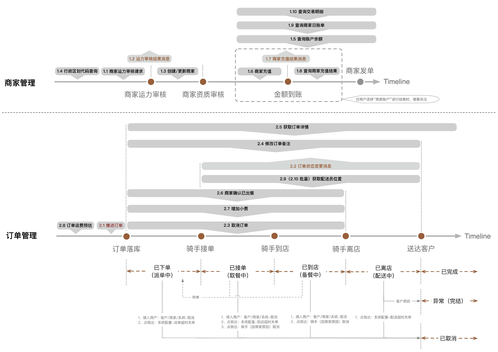

[**首页**](https://open.dianwoda.com/) /
- <a href="#接口调用时间轴">接口调用时间轴</a>
- <a href="#接口更新日志">接口更新日志</a>
- <a href="#常见问题">常见问题</a>

# 0.1 接口说明

### 接口调用时间轴

### 常见问题

针对接口 | 问题|解答
---|---|---
开发问题|签名错误问题？|详见 [签名代码示例](0.2%20开发须知.html#签名代码示例)
开发问题|获取accseetoken|开发者账号登录管理中心，申请应用授权后，在授权管理》我获得的授权》授权列表》点击【查看】，弹窗中会展示【Token】。
测试问题|测试环境推单|需要推送定位城市为“杭州”的订单。
结算问题|结算账户与充值|1）联系点我达运营人员后台设置线上结算账户（渠道统一账户or门店自主账户）； 2）若用渠道统一账号结算，则请进入开放运营平台-财务管理模块进行渠道账户充值； 3）若用门店自主账号结算，则请调用“1.6 商家充值接口”为门店进行充值。
公共|联系方式的格式校验是什么？|1）手机号：中国大陆11位手机号，例:13800000000。如果是带分机号的隐私号则可以通过“转”、“_”、“-”，“,”四个特殊字符中任意一个将分机号拼接传入，例:17000000000转1、17000000000-1、17000000000_1、17000000000,1 2）固话：是否加区号均可，区号长度允许为3或4位，电话长度仅允许为8位，仅允许“-”特殊字符；例：58654567,023-58654567
2.5 获取订单信息|什么是恶劣天气加价？|点我达根据事先与接入方约定的加价规则，在出现恶劣天气时，由点我达平台主动给订单增加天气补贴的手段，使运力倾斜；默认禁用，若要开启可联系运营。
2.5 获取订单信息| 什么是短信服务费？|配送员取完货开始配送时，短信通知消费者；默认禁用，若要开启可联系运营。
2.1 推送订单|可以重复推单吗？|点我达订单系统不允许重复推送当天的订单，以及历史未完结的订单。
